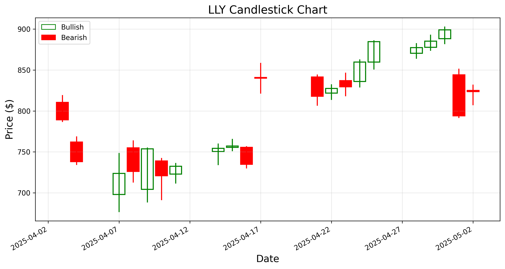
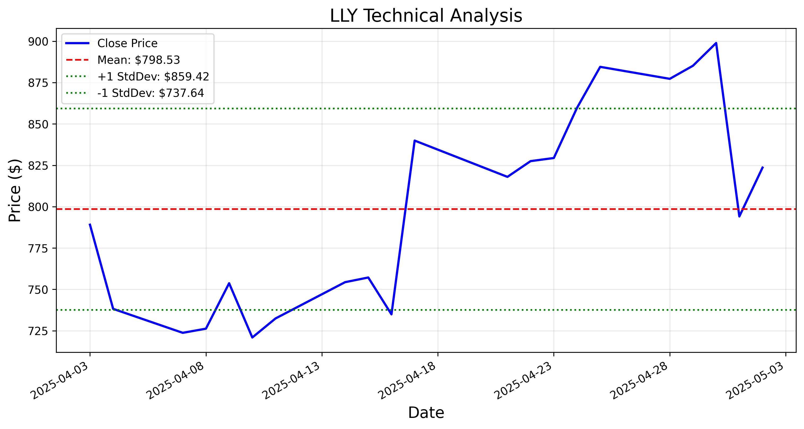
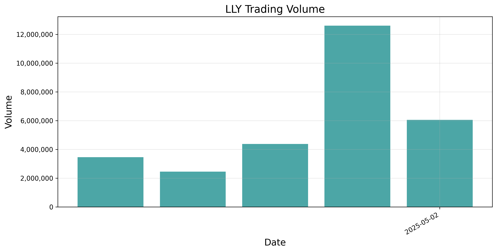

# Stock Market Analysis System

A sophisticated stock market analysis system powered by CrewAI and Groq, featuring multi-agent collaboration, real-time market data analysis, and interactive visualization capabilities.

## Workflow Overview

The system follows a structured workflow to provide comprehensive stock analysis:


1. **Natural Language Query Processing**:
   - User submits a query about a company or industry (e.g., "analyze Microsoft" or "pharmaceutical company")
   - The query is processed by a ChromaDB vector database that matches it to the most relevant stock ticker and company information
   - Natural language understanding enables users to describe companies without knowing exact ticker symbols

2. **Multi-Agent Collaboration**:
   - **Market Analyst**: Conducts technical analysis including price trends, support/resistance levels, and technical indicators
   - **News Analyst**: Gathers and summarizes recent news, analyzing sentiment and potential market impact
   - **Strategy Synthesizer**: Integrates both technical and news analyses into a comprehensive investment strategy with detailed reasoning

3. **Autonomous Tool Selection**:
   - Each agent autonomously selects appropriate tools from the available MCP (Model Context Protocol) toolset in data_fetcher.py
   - Agents decide which data to fetch and how to process it based on their specific analytical needs
   - Tools include stock data retrieval, historical analysis, news gathering, and market overview functions

4. **Output Generation**:
   - Raw data from API calls is transformed into structured, human-readable analysis
   - Results are presented in a clear format with technical metrics, news summaries, and actionable investment strategies
   - Visualizations are generated to support the analysis where appropriate

This workflow enables a seamless experience from natural language queries to detailed market analysis without requiring users to have specialized financial knowledge or programming skills.

## Features

- **Multi-Agent Collaboration**: Three specialized AI agents working together:
  - Market Analyst: Expert in technical and fundamental analysis
  - News Analyst: Skilled in news sentiment and market impact analysis
  - Strategy Synthesizer: Combines insights into actionable recommendations

- **Market Analysis**:
  - Real-time stock price tracking
  - Technical indicators and chart patterns
  - Market sentiment analysis
  - News impact assessment
  - Comprehensive market overview (SPY, DIA, QQQ, VIXY)

- **Interactive Web Interface**:
  - Modern Streamlit-based UI
  - Real-time market data visualization
  - Interactive chat interface
  - Customizable analysis period
  - Downloadable analysis reports

- **Vector Database**: 
  - ChromaDB for semantic search of company information
  - Natural language queries to find relevant stocks
  - Comprehensive company metadata and business summaries
  - Auto-populated with top companies by market cap

- **Technical Stack**:
  - CrewAI for multi-agent collaboration
  - Anthropic Claude for advanced AI capabilities
  - Alpha Vantage API for market data
  - Streamlit for web interface
  - Model Context Protocol (MCP) for efficient API data fetching
  - ChromaDB for vector search capabilities
  - Async/await for concurrent operations

## Model Context Protocol (MCP)

The system leverages Model Context Protocol (MCP) to efficiently fetch and process real-time market data:

- **Efficient Data Fetching**: MCP enables concurrent API calls and data processing
- **Tool Execution**: Provides a standardized way to execute API tools and process responses
- **Error Handling**: Built-in error handling and retry mechanisms
- **Async Operations**: Seamless integration with async/await patterns

## Installation

1. Ensure you have Python >=3.10 <3.13 installed

2. Install UV for dependency management:
   ```bash
   pip install uv
   ```

3. Create and activate a virtual environment using UV with all dependencies from pyproject.toml:
   ```bash
   # Create a virtual environment
   uv venv .venv

   # Activate the virtual environment
   # On Linux/Mac
   source .venv/bin/activate
   # On Windows
   .venv\Scripts\activate

   # Install dependencies from pyproject.toml
   uv pip install -e .
   ```

4. Set up your environment variables in `.env`:
   ```
   GROQ_API_KEY=your_api_key_here
   ALPHA_VANTAGE_API_KEY=your_alpha_vantage_api_key_here
   ```

5. Set up ChromaDB with company data:
   ```bash
   # Populate the vector database with top 100 companies by market cap
   python -m src.business_intelligence_agent.ticker_fetcher --load
   
   # Test that it's working with a query
   python -m src.business_intelligence_agent.ticker_fetcher --query "technology companies"
   ```

## Vector Database Setup

The system uses ChromaDB to store information about companies and enable semantic search capabilities.

### Loading Company Data

By default, the ticker_fetcher script loads the top 100 companies by market cap:

```bash
python -m src.business_intelligence_agent.ticker_fetcher --load
```

This will:
- Fetch company information from NASDAQ and NYSE exchanges
- Sort them by market cap and take the top 100 (by default)
- Store them in a ChromaDB database in the `chroma_db` directory
- Include company name, symbol, sector, industry, market cap and business summary

To load all available companies instead of just the top 100:
1. Open `src/business_intelligence_agent/ticker_fetcher.py`
2. Find the line `tickers = fetcher.fetch_all_tickers(sample_mode=True)`
3. Change it to `tickers = fetcher.fetch_all_tickers(sample_mode=False)`
4. Run the script again with `--load` parameter

### Testing Vector Search

To test that your vector database is working correctly:

```bash
# Search for technology companies
python -m src.business_intelligence_agent.ticker_fetcher --query "technology companies"

# Search for pharmaceutical companies
python -m src.business_intelligence_agent.ticker_fetcher --query "pharmaceutical companies"

# Set number of results (default is 5)
python -m src.business_intelligence_agent.ticker_fetcher --query "renewable energy" --results 10
```

## Usage

1. Start the web interface:
   ```bash
   streamlit run src/business_intelligence_agent/app.py
   ```

2. Use the sidebar to:
   - Select analysis period
   - Refresh market data
   - Clear chat history

3. Interact with the system:
   - View real-time market overview
   - Ask questions about stocks and market trends
   - Receive comprehensive analysis from AI agents
   - Download detailed reports

## Project Structure

```
business_intelligence_agent/
├── src/
│   └── business_intelligence_agent/
│       ├── config/
│       │   ├── agents.yaml
│       │   └── tasks.yaml
│       ├── app.py
│       ├── crew.py
│       ├── data_fetcher.py
│       ├── ticker_fetcher.py
│       └── visualization.py
├── tests/
├── chroma_db/     # Vector database storage
├── knowledge/
└── pyproject.toml
```

## Agent Configuration

The system uses three specialized agents:

1. **Market Analyst**:
   - Technical and fundamental analysis
   - Price trends and patterns
   - Volume analysis
   - Technical indicators

2. **News Analyst**:
   - Market news analysis
   - Sentiment evaluation
   - Impact assessment
   - Industry context

3. **Strategy Synthesizer**:
   - Investment recommendations
   - Risk assessment
   - Entry/exit points
   - Price targets

## Contributing

Contributions are welcome! Please feel free to submit a Pull Request.

## License

This project is licensed under the MIT License - see the LICENSE file for details.

## Examples and Screenshots

### Streamlit Interface

The application features a user-friendly Streamlit interface that allows users to interact with the AI agents and view analysis results.

#### Market Overview Screen


#### Chat Interface


#### Analysis Results


#### Strategy Recommendations


### Example Visualizations

The system generates various charts to support the analysis.

#### Candlestick Chart


#### Technical Analysis


#### Volume History


### Example Analysis Output

Below is a snippet from an example analysis of Eli Lilly (LLY):

```markdown
# Market Analysis Report for Eli Lilly and Company (LLY)

## Company Information
- **Sector**: Health Care
- **Industry**: Pharmaceuticals
- **Market Cap**: $841,423,000,000
- **Current Price**: $886.33
- **Change**: +$9.25 (+1.05%)
- **Volume**: 2,334,693
- **Analysis Date**: 2025-05-04
```

For the complete sample analysis output, see [LLY_analysis.md](output/LLY_analysis.md) in the output directory.
